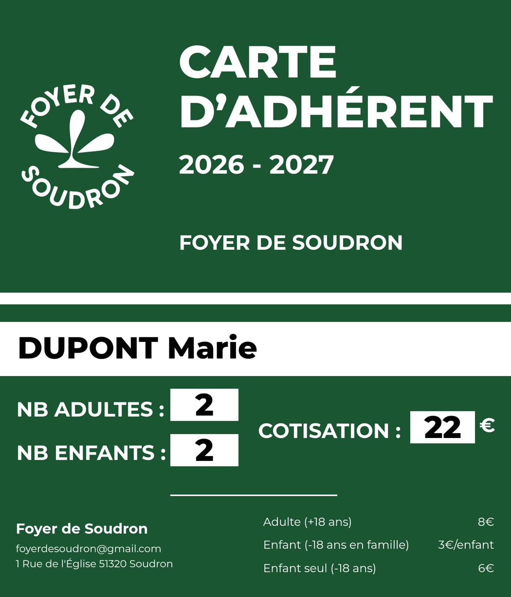
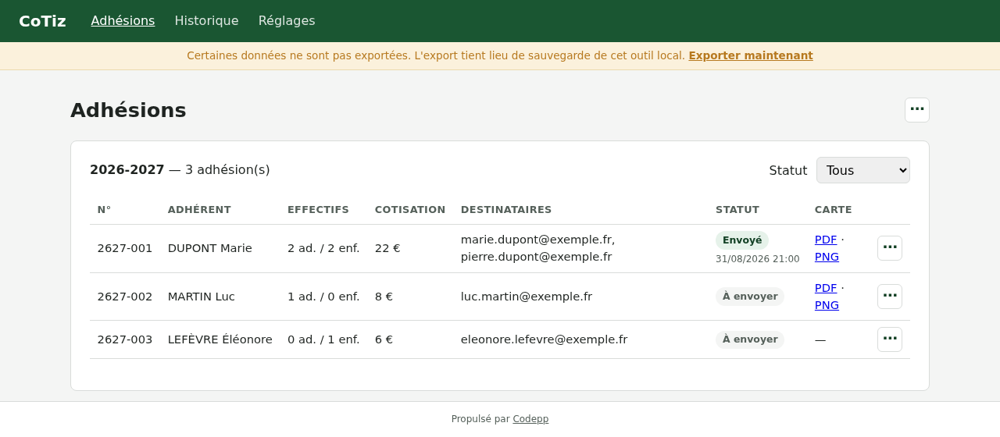
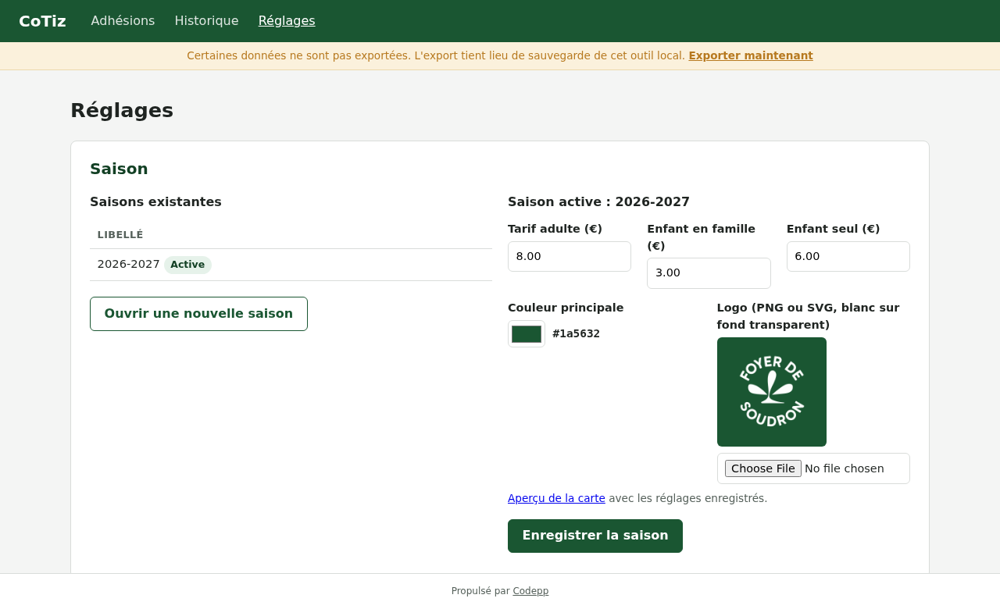

<div align="center">

# CoTiz

**Cartes d'adhérent dématérialisées, générées et envoyées en un clic.**

Import du classeur de la trésorière → génération des cartes PDF/PNG → envoi
personnalisé par mail, avec suivi. Conçu pour le Foyer de Soudron, pensé pour
durer après son auteur.




</div>

---

## Le problème

Chaque année, l'association délivre ses cartes d'adhérent : création manuelle
de chaque carte dans Canva, export, nommage du fichier, rédaction d'un mail
personnalisé, pièce jointe, envoi… pour des dizaines d'adhérents. Un processus
chronophage, et qui a déjà produit des erreurs de saisie — la pire étant une
cotisation fausse sur une carte officielle.

## La solution

Un outil web **local** (Docker, un seul service) utilisé quelques jours par an :

1. la trésorière remplit un **classeur normalisé** (généré par l'outil, avec
   listes déroulantes, formules et contrôle d'écart intégrés) ;
2. CoTiz **importe** le classeur avec un écran de contrôle — lignes valides,
   avertissements, rejets — sans rien écrire avant validation ;
3. la **cotisation est calculée, jamais saisie** : la classe d'erreur qui
   posait problème n'existe plus ;
4. les **cartes** sont générées en PDF (pièce jointe) et PNG (intégré au
   corps du mail), d'abord en **mode test** sans aucun envoi ;
5. l'**envoi** se fait adhésion par adhésion, piloté par le navigateur, avec
   barre de progression, statut par adhésion, renvoi unitaire et copie cachée
   systématique vers l'expéditeur.



## Fonctionnalités

- **Import XLSX/CSV** contrôlé : rejets et avertissements motivés ligne par
  ligne (homonymes, écart entre montant encaissé et cotisation calculée…)
- **Classeur modèle téléchargeable**, pré-rempli avec les tarifs de la saison
- **Carte 100 % HTML/CSS** : aucun fond d'image, rendu vectoriel net ; logo,
  couleur, tarifs, textes — tout se règle depuis l'écran Réglages
- **Saisons historisées** : une carte de 2025-2026 rééditée plus tard affiche
  les tarifs et la charte de 2025-2026
- **Mail personnalisable** en texte riche (variables `{{prenom}}`,
  `{{cotisation}}`…), test de connexion SMTP intégré
- **Sauvegarde en un clic** : archive complète restaurable sur n'importe
  quelle installation, bandeau d'alerte tant que des modifications ne sont
  pas exportées
- **Historique** par saison, **saisie manuelle** pour les corrections,
  **authentification désactivable** (inutile en local, prête pour une mise
  en ligne)



## Démarrage

Prérequis : Docker et Docker Compose. Rien d'autre.

```bash
git clone git@github.com:corentinmarcoux/cotiz.git && cd cotiz
cp .env.example .env      # renseigner le mot de passe d'application SMTP
docker compose up -d
```

Puis <http://localhost:8000>. Le premier démarrage construit l'image, génère
la clé de chiffrement, migre et seed la base — aucune commande `artisan` à
taper. Les fois suivantes : `docker compose up -d`.

Aperçu du gabarit de carte sur données fictives : `/cartes/apercu`.

## Architecture

### Choix structurants

| Choix | Pourquoi |
|---|---|
| Local d'abord, conteneurisé dès le premier jour | L'outil tourne sur le poste de l'opérateur ; le jour où l'asso a un serveur, la mise en production est un fichier compose, pas une réécriture |
| SQLite, bind mount sur `./data` | Volumétrie négligeable ; tout l'état (base, clé, logos, cartes) est un dossier visible et sauvegardable |
| Carte en HTML/CSS convertie par Chromium (Browsershot) | Un successeur ajuste une position dans un fichier CSS commenté, sans toucher à une image |
| Envoi séquentiel piloté par le navigateur | Une requête par adhésion : pas de file d'attente, pas de timeout, opération reprenable |
| Aucune valeur métier en dur | Tarifs, textes, expéditeur, logo, couleur : tout est en base, éditable depuis l'écran Réglages |
| Sauvegarde applicative | Les secrets sont déchiffrés à l'export et re-chiffrés à la restauration : l'archive est indépendante de la clé de l'installation |

### Séparation des responsabilités

Les composants Livewire orchestrent, ils ne calculent pas. Chaque règle métier
vit dans un service unique :

| Service | Responsabilité |
|---|---|
| `CalculateurCotisation` | Effectifs + tarifs d'une saison → montant |
| `LecteurClasseur` | Classeur XLSX/CSV → collection de DTO `LigneAdhesion` |
| `ValidateurImport` | DTO → verdict valide / avertissement / rejet |
| `EnregistreurAdhesion` | DTO → adhésion persistée (réutilisable hors écran) |
| `GenerateurCarte` | Adhésion → fichiers PDF et PNG |
| `EnvoyeurCarte` | Adhésion → mail envoyé, statut mis à jour |
| `ComposeurMail` | Gabarits + variables → objet et corps du mail |
| `SauvegardeApplication` | Tout l'état ↔ archive ZIP restaurable |

Le cadrage complet — décisions datées, modèle de données, contrat d'import,
journal des arbitrages — est dans [`claude.md`](claude.md) : c'est le contrat
du projet, tenu à jour à chaque évolution.

### Structure

```
app/
├── Dto/            LigneAdhesion, VerdictLigne, DonneesCarte
├── Enums/          StatutAdhesion, CleReglage, NiveauVerdict
├── Livewire/       Écrans (Import, Adhésions, Réglages) — orchestration seulement
├── Mail/           CarteAdherentMail (PNG intégré + PDF joint)
└── Services/       Les règles métier, une classe par responsabilité
resources/
├── cartes/         gabarit.css — toute la géométrie de la carte, commentée
└── views/          Blade : écrans, gabarit de carte, mails
data/               Tout l'état : SQLite, clé, logos, cartes générées (non versionné)
```

## Qualité

- **Tests ciblés** là où une erreur silencieuse coûterait cher : calcul de
  cotisation, lecture du classeur, validation d'import, génération de bout en
  bout (vrai Chromium), envoi, sauvegarde/restauration, authentification —
  `make test`
- **Laravel Pint** pour le style
- Nommage français pour le domaine métier, anglais pour l'infrastructure
- Aucun commentaire nécessaire : le code se lit par ses noms (exception
  volontaire : le CSS de la carte, commenté pour un successeur non développeur)

## Données et sauvegarde

Tout vit dans `./data`, jamais dans un dossier synchronisé (SQLite et la
synchronisation de fichiers font mauvais ménage). La sauvegarde officielle se
fait depuis **Réglages → Sauvegarde** ; en complément, `make backup` /
`make restore ARCHIVE=…` copient le dossier tel quel.

## Production (différé, préparé)

Rien n'empêche une mise en ligne : configuration par variables
d'environnement, aucun chemin en dur, authentification prête derrière
`APP_AUTH_ENABLED`. Le gabarit de durcissement (read_only, pids_limit adapté à
Chromium, shm_size…) est documenté dans le cadrage, section 10.

---

<div align="center">

Développé par [Corentin Marcoux](https://codepp.fr) · Propulsé par **Codepp**

</div>
